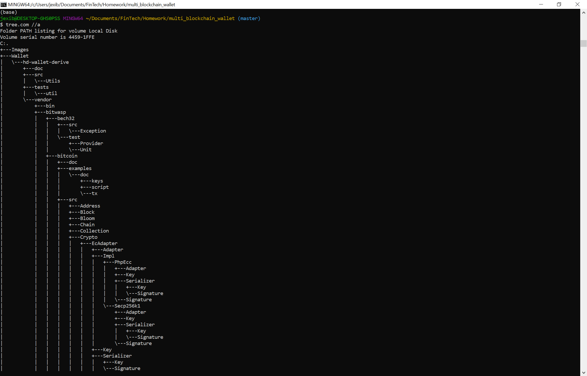
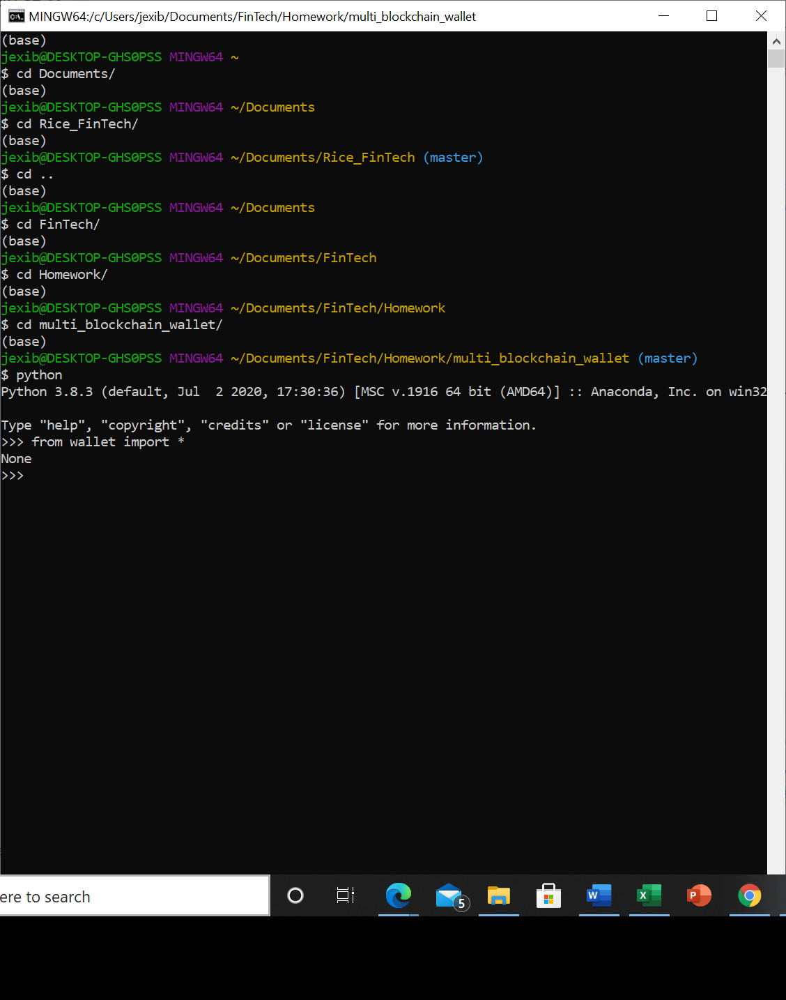
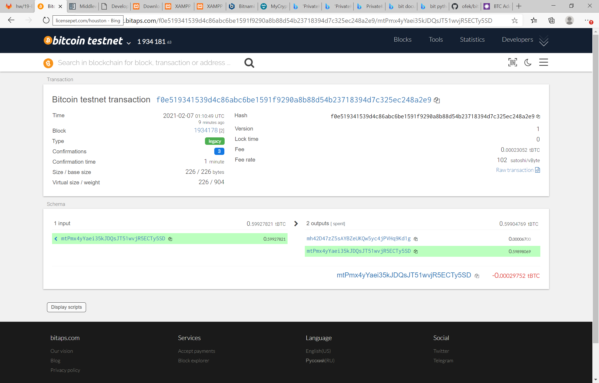
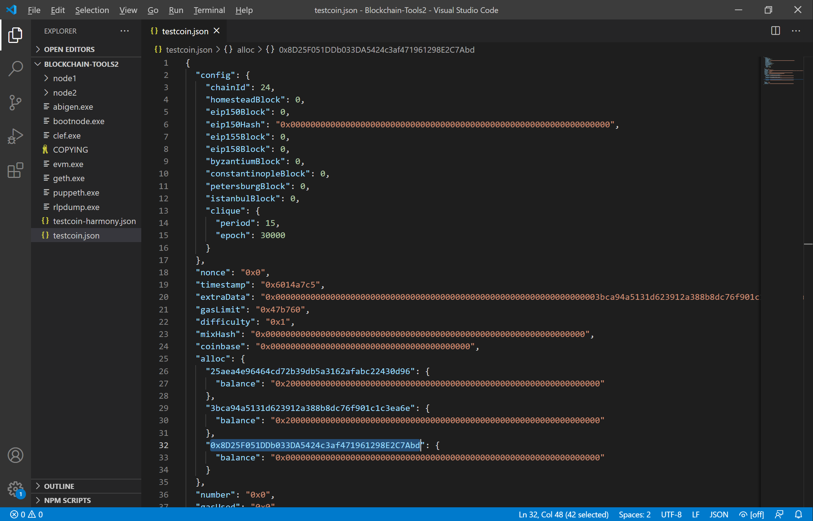
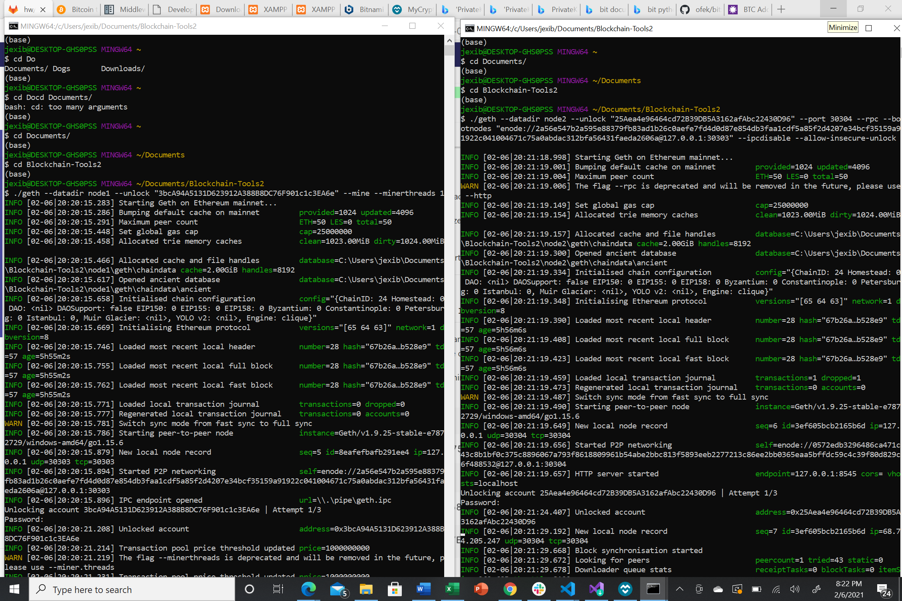
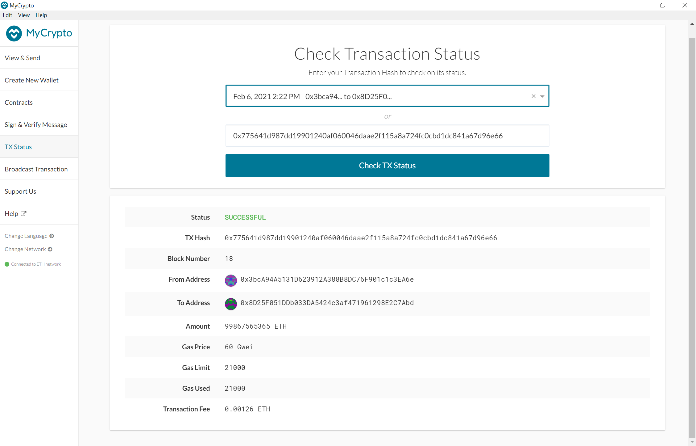
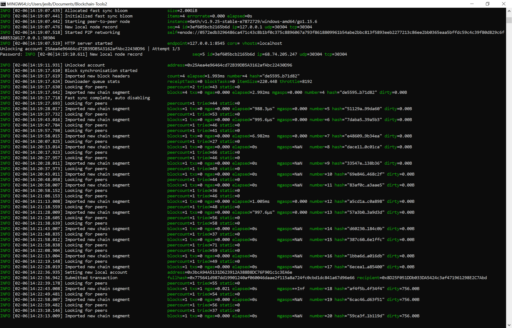

# Multi Blockchain Wallet
Multi Blockchain Wallet is digital wallet that have different cryptocurrencies such as Ethereum and Bitcoin. Both coins using a testnet to make real transactions.

## Wallet Creation
* The Wallet is made in python using different libraries such as bit for Bitcoin and web3 for Ethereum. 
* It also needed hd-wallet-derive tool which I had to clone and created a symlink called derive to call hd-wallet-derive in mallet.py library. So Wallet tree looks like:
  
* Wallet.py had four functions in order to make  transactions. To uses it you will need to first assign account = priv_key_to_account(coin, priv_key) in which you must specify the coin (ETH or BTCTEST) and the private key of the account you want to use, then you have to call send_tx (coin, account, to, amount) function in which you must specify the coin (ETH or BTCTEST), the account you previously assigned, the account of the recipient in a string, and the amount to send. To run the send_tx function you will need to copy this repository, open you terminal and navigate to this repo. Then run python command and copy from wallet import *.
  

## Bitcoin Test Transaction
After running send_tx you can check your transactions information in block explorer [Bitcoin_testnet](https://tbtc.bitaps.com/)

## Ethereum Transaction
* To make an Ethereum transaction I used one of my local Proof of Authority algorithm and added one the wallet.py's ETH account in the json file.

* Then in the terminal I deleted the node/geth folders, initialized the nodes again, and started mining.
  
* After having the two nodes mining I went to MyCrypto connecting to the new network Testcoin, went to Keystore File to import node1 keystore which is inside of Geth & Tools folder, node1, keystore. Then copy the address of wallet.py's ETH account and make the transaction. To check the status of the transaction I went to TX Status in MyCripto.
  
  you can also see the transaction in the mining nodes
  

  
